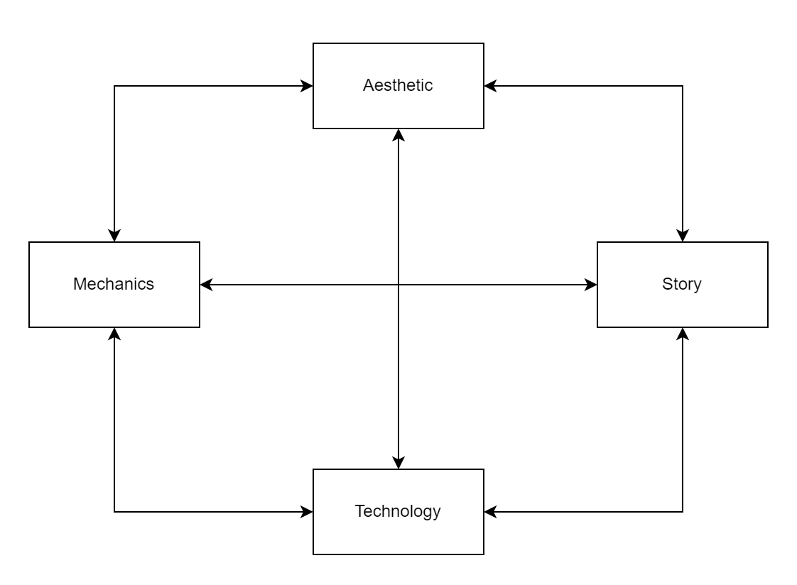
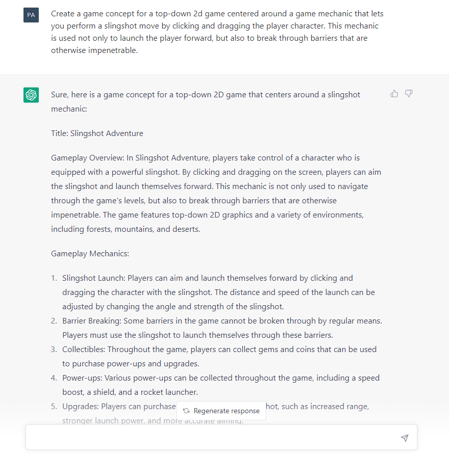

[[Back to Main Page]](README.md/#production-guide-for-solo-game-development)

# Concept Phase

In the `Concept Phase`, you will funnel your many ideas into a single, clearly defined game concept and critically evaluate it. If you are satisfied, you will make the commitment to move into Pre-Production.

## Table of Contents

> 1. [Collecting Game Ideas](#collecting-ideas)
>    - 1.1 [Brainstorming](#brainstorming)
>    - 1.2 [Inspiration](#inspiration)
> 2. [Creating A Game Concept](#creating-concept)
> 3. [Evaluating The Concept](#evaluating-concept)

---

## 1. Collecting Game Ideas

A game idea is just that - an idea, like `"2D game where you can perform a slingshot move by clicking and dragging the player character"`. No specifics are required at this stage.

### 1.1 Brainstorming

If you plan to use this guide for your own game project, you probably already have one or more game ideas in mind. If not, a focused brainstorming session can help you collect as many game ideas as possible, or play around with different variations of the same idea. A good web application for brainstorming is [Kinopio](https://kinopio.club/):

It serves as a virtual whiteboard and can help you visually organize and connect ideas. I mostly use it temporarily for mind-mapping and instead collect the most promising game ideas as notes in my [OneNote](https://www.onenote.com/?public=1) notebook (which I use for other stuff, too). This makes it easier to quickly write down ideas on my mobile phone.

### 1.2 Inspiration

Personally, I often can't stop my brain from constantly producing new game ideas, but sometimes everyone gets stuck. So if you need help coming up with ideas, consider the following approaches:
- *Play games*: Start by playing a wide variety of games, from different genres and platforms. Analyze what you enjoy about each game and what makes it unique. Consider how you could incorporate these elements into your own game.
- *Identify a problem to solve*: Think about problems that you or others face in their daily lives. This could be anything from a lack of motivation to exercise to difficulty in learning a new language. Brainstorm ways that a game could help solve this problem.
- *Look for inspiration in other media*: Draw inspiration from books, movies, and TV shows. Consider how you could adapt a particular story or concept into a game.
- *Explore new technology*: Keep up-to-date with new technology and innovations in the gaming industry. Consider how new hardware, such as virtual reality headsets or haptic feedback controllers, could be used to create new gaming experiences.
- *Consider your own passions and interests*: Think about your own hobbies and interests. Consider how you could incorporate these into a game. For example, if you enjoy hiking, you could create a game that simulates a hiking adventure.
- *Combine different ideas*: Try combining different ideas to create something unique. For example, you could combine a puzzle game with a platformer or a survival game with a city-builder.
- *Collaborate with others*: Brainstorm with others and collaborate on game ideas. Consider working with people from different backgrounds and skill sets, such as artists or programmers.
- *Think about your target audience*: Consider who you want to make games for and what they would enjoy. Think about the age group, interests, and gaming experience of your target audience.

[[Back to Top]](#concept-phase)

---

## 2. Creating A Game Concept

It is time to work out a proper game concept. This means that you need to choose a single game idea that you want to flesh out. Although the game concept will still only be a very short summary, it will lay the groundwork for everything that follows (_spoiler_, what follows is a lot of work), and I've seen indie developers create stunning art and impressive tech demos for projects that they ultimately had to cancel because they didn't have a solid game concept.

A game concept should be less than one page in length and include the following elements:
- *Game Overview*: A short, compelling summary of the game, written like an elevator pitch.
- *Genre*: The game's genre, like `Action` and `Arcade`.
- *Visuals And Viewpoint*:[^1] Descriptive tags for how the game will look like, such as `2D`, `Top-Down`, and `Abstract`.
- *Story*/*Narrative* (if applicable): A brief description of the game's narrative, including setting and core themes.
- *Gameplay Mechanics*: A list of the game's most important and unique gameplay mechanics. This does not need to be exhaustive, but should give an idea of how the game will be played.
- *Target Audience*: A description of the target audience, such as `"casual gamers of all ages"`.
- *Platforms*: The platform(s) for which the game will be created.

[^1]: Taken from the filter options in the Steam store. You can find descriptor tags by browsing the available options.

Each of these elements is extremely important, not only for pitching your idea, but also for making good design choices later on. No matter how experimental and artsy your game is, your game concept should include all of these elements. However, the exact format varies and should be adapted to what works best for your particular game. As an example, you can find the game concept for the `SLINGSHOT` project [here](https://share-docs.clickup.com/9004010474/d/h/8cawjza-1327/5969df1d1dbeaa2).

It can also help to break down the game into four core components, all of which interact with each other:

You can see that the `Technology` component is not fully drawn, because it is not very important yet. More important are the relationships between `Mechanics` - the processes and rules of your game, `Aesthetic` - the look, feel, *vibe* of your game, and the `Story` - the sequence of events in your game creating a coherent experience.

If you need more help, you might want to try turning your game idea into a concept by iterating on some creative and concise prompts to ask [ChatGPT](https://chat.openai.com/chat):

> If you have trouble turning a vague game idea into a concrete concept, you should take that as a warning sign - not that the idea is worthless, but that you should not go any further in the development process until you have a concept. Seriously. Take your time, let the idea grow in the back of your mind. Instead of dwelling on this one idea, you should consider going back to the [previous step](#collecting-ideas).

[[Back to Top]](#concept-phase)

---

## 3. Evaluating The Concept

Now that you have a game concept, there is one last evaluation to go through before moving into pre-production. Especially for solo game development, this can be an extremely important step, as it may be your last chance to find some critical shortcomings in your concept before wasting a lot of time on it.

To evaluate the concept, answer all of the following questions (note that some of these questions include considerations for GHOSTS & GLITTER video content): [^2]

[^2]: These questions are derived from Warren Spector's GDC talk ["Classic Game Postmortem: Deus Ex"](https://youtu.be/tffX3VljTtI).

1. What is the *core of the game idea*? Start by identifying the central gameplay mechanic or concept that makes your game idea unique. This will serve as the foundation for the rest of the game's design.
2. How *well-suited is the idea to games* as a medium? Consider how well the game idea lends itself to being translated into a game. For example, if your game idea is heavily focused on narrative, ask yourself if it would be better suited to a different medium, such as a book or film.
3. What is the *player fantasy*? (might not apply to all games) Think about the experience that the player will have while playing the game. What fantasy or role-playing experience will they be able to live out? This could be something like being a spy, or - for a narrative game focused on emotional storytelling - something like overcoming an emotional trauma. Really try to understand this fantasy and what is intriguing about it so that you can make the right design decisions to create the desired experience.
4. *What are you trying to say* with this game? Related to the previous point, think about the message or themes that you want to convey through the game. Be specific - don't start with "exploring ...". If you are exploring mental health, for example, decide on a theme like "what it feels like to have brain fog in everyday life" or a message about "the healing power of emotional connection". Understanding the themes or message you want to convey can be another extremely important step as it will basically make design decisions for you (does this mechanic support the game's themes/message?).
5. Why do you want to make *this game specifically*? Identify what you hope to achieve with this game. Are you aiming for commercial success? Do you want to make a statement about a particular topic? Understanding your goals will help guide the development process.
6. What are the *biggest challenges* for the making of this game? Consider the technical and design challenges that you will face in making the game. This could include anything from implementing a complex AI system to designing a user-friendly UI.
7. How well does this game *fit to your currently available resources*? Consider how well the game fits with your available resources, such as time, money, and team size. This will help you determine whether the game is feasible to develop given your current limitations.
8. How can this game be used to *showcase aspects of game development*? Consider how the game can be used to showcase particular aspects of game development in form of engaging video content. Is there a specific topic you could make an educational video about for other game devs while using this game idea as a practical example? Or what kind of video could reach a wider audience and introduce artists and art-interested people to the development process of games?
9. How can this game be used to *analyze the unique aspects of games as an artistic medium*? Similarly, consider how the game can be used to demonstrate the unique aspects of games as an artistic medium. This could include interactivity, player agency, or emergent gameplay. Here too you should focus on avoiding gate-keeping and try to find ways to draw in as many people as possible who may not be particularly familiar with games.

> Once again, if you have trouble answering these questions, consider putting in more work into the concept or going back to the [Brainstorming](#brainstorming) section.

If you were able to answer all of the questions above in a satisfying way, you are ready to move into [Pre-Production](2_PreProduction.md/#pre-production).

[[Back to Top]](#concept-phase)

[[Back to Main Page]](README.md/#production-guide-for-solo-game-development)